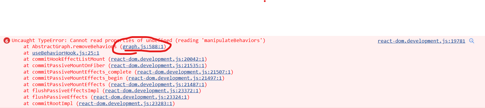
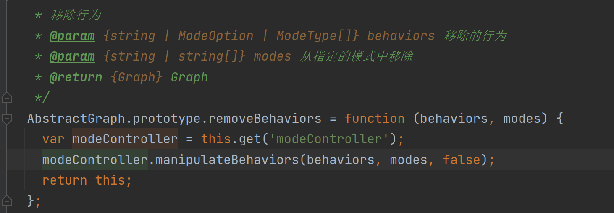

## 安装依赖
`npm install`

## 执行项目
`react-app-rewired start`

## 项目对应网上demo
https://codesandbox.io/s/3ckhu9

## 项目报错

在浏览器上调试,将问题定位到
`E:\study\now\bishe\code\sbom2\node_modules\@antv\g6-core\es\graph\graph.js`文件中第576-599行这几个函数，
`this.get('modeController')`方法并没有获得之前初始化时设置的值（第71-76行）导致读出undefined类型参数报错

